    
     
    

<h1 align="center" style="border: none;">Hello, my name is Michael Roy!</h1>
<h1 align="center" style="border: none;">🎖️ Software Engineer | Veteran | Technical Team Lead 🎖️</h1>

 

<h2 align="center">👨‍💻 Skills & Tools 👨‍💻</h2>
 

  <table>
    <tr>
      <td align="left" style="border: none;">
        <h3 align="center">Languages</h3>
        
        
        <!--  -->
        <!--  -->
        
        
      </td>
      <td align="right">
        <h3 align="center">Frameworks & Libraries</h3>
        
        
        <!--  -->
        
        
        <!--  -->
        
        
      </td>
    </tr>
  </table>

 

  <table>
    <tr>
      <td align="left">
        <h3 align="center">Cloud & DevOps</h3>
        
        
        
        
        <!--  -->
      </td>
      <td align="center">
        <h3>CI/CD Tools</h3>
        <!--  -->
        
      </td>
      <td align="right">
          

        <h3>Containerization</h3>
        
        <!--  -->
        

      </td>
    </tr>
  </table>

 

  <table>
    <tr>
      <td align="left">
          

        <h3>Automation</h3>
        <!--  -->
        
          

      </td>
      <!-- <td align="center">
          

        <h3>Currently Learning: Monitoring & Logging</h3>
        
        
          

      </td>-->
      <td align="right">
        <h3 align="center">Databases</h3>
        
        <!--  -->
        <!--  -->
        
      </td>
    </tr>
  </table>

 

<!-- 

  <table>
    <tr>
      <td align="center">
        <h3>Testing & TDD</h3>
        
        
        
        
         
        
      </td>
    </tr>
  </table>

 -->

    <h2>📜 Short Bio 📜</h2>

  🔭 I'm passionate about leveraging technology to drive innovation in healthcare and fintech. While I've enjoyed working with dynamic languages like Python and JavaScript, I'm increasingly drawn to the stability, performance, and enterprise-level support offered by C#. As a memory-safe language, C# helps prevent common vulnerabilities and ensures the security and reliability of critical applications. I'm focused on mastering C# and related .NET tools to develop robust and scalable solutions that meet the stringent requirements of these industries and looking forward to seeing what is possible in these expanding fields!

  💬 Ask me about **Running servers inside of mountains and teaching funny phrases in Portuguese — I specialize in deep data and even deeper laughs!**

  ⚡ Fun fact: **Managing data centers 300 feet underground — it's like Minecraft, but the stakes are real and the creepers wear suits.**

  😎 Current hobbies: **Mastering Portuguese one "obrigado" at a time 🇧🇷, unraveling stories in my ever-growing book stack 📚, and weaving magic in the digital crafting realm 🧙‍♂️+💻**

 

      
      
      
        
   

<!--
<h2 align="center">🔭 I’m currently working on 🔭</h2>
 

  - 🛠️ **DevOps**:
    - AWS Network Architecture Design
    - Cloud Engineering
    - [AWS Network Diagram 🎨 (Created by Michael Roy)](https://michael.github..io/animated-diagram)
    - Focusing on building robust and secure VPCs with public and private subnets, NACLs, and Security Groups.
    - Deploying EC2 instances across multiple Availability Zones for high availability and fault tolerance.
    - Setting up NAT Gateways for outbound traffic from private instances.
    - Implementing Route 53 for DNS management.
    - Using AWS CloudWatch for monitoring and logging.
    - Adhering to AWS Well-Architected Framework best practices.
  - 💻 **Software Development**:
    - Hybrid Real Estate Property Tracker & Analyzer/Fitness-game mobile app
    - Workplace automation within the logistics and education sectors. I love YAML!

  <!--

 -->
<!--Add Projects & Education Sections Here-->
<h2 align="center">🏆 Achievements 🏆</h2>
 

  <ul>
    <li>🏅 Team Lima - 1st Place Hackathon Winners (2024) with the project "<a href="#deep-impact">Deep Impact</a>"</li>
  </ul>

 

<h2 align="center">📚 Projects 📚</h2>
 

  
  <h3>Validation Station - Mar 2024</h3>
  <a href="https://github.com/its-michaelroy/ValidationStation">github.com/its-michaelroy/ValidationStation</a>
    
 

  
Application created for businesses as a way to create a database of valid contact information and for individual use as a way to avoid spam via email and phone calls. Future use will include a way to import and export csv data for blacklist and whitelist. Built using Python, JavaScript ES6, Django, React, and a PostgreSQL database for storing user Login, Email, and Phone information. Utilizes API for email and phone number validation from Big Data Cloud.

   
  
  <h3>Platoon Console - Apr 2024</h3>
  <a href="https://github.com/L-Carr/Platoon-Console">github.com/L-Carr/Platoon.Console</a>
    
 

  
Web application dashboard for managing Code Platoon cohorts, offering centralized access to course materials. Built using Python, JavaScript ES6, Django, React, and a PostgreSQL database with Google API.

   
  
  <h3 id="deep-impact">Deep Impact - May 2024</h3>
  <a href="https://deep-impact.onrender.com/">deep-impact.onrender.com/</a>
  
 

  
Web application designed to provide users with educational insights into the potential dangers of asteroid impacts. Built using Python, JavaScript ES6, Django, React and hosted on Render with NASA’s Sentry API.

   
  
  <h3>Stock Smart Pantry Tracker - Jul 2024</h3>
  <a href="https://ai-stock-smart-ims.vercel.app/">ai-stock-smart-ims.vercel.app</a>
    
 

  
Project showcases expertise in modern web development frameworks, data management with full CRUD (Create, Read, Update, Delete) capabilities, and user interface design using MUI components.
  Built a real-time pantry tracking application with React, NextJS, MUI, and Firebase.

   
  
  <h3>FlashAce AI - Aug 2024</h3>
  <a href="https://github.com/Headstarters/Flash-card-app">github.com/Headstarters/Flash-card-app</a>
    
 

  
Dynamic AI flashcard application with study mode, allowing users to generate custom decks for efficient learning.Built using Next, React, JavaScript ES6, MUI, Firebase, Clerk, OpenAI, and Stripe API.

   

 
<!-->

 <!--

  <h2>🐍 My Contributions 🐍</h2>
   
  
   

-->

<h2 align="center">📊 Stats 📊</h2>
 

  <h3>🔥 GitHub Streak Stats</h3>
    
  <h3>📈 GitHub Overall Stats</h3>
  
    
  <h3>💻 Language Usage</h3>
  
    
  <h3>🧩 Consolidated Metrics</h3>
      <table style="border: none; margin: auto;">
          <tr>
            <td style="background-color: #2E3440; border: 2px solid #4c566a; border-radius: 10px; padding: 10px;">
              
            </td>
          </tr>
      </table>
<!--  -->

 

   
 
<h2>🧙‍♂️+☕️ Crafting Code and Cultivating Calmness 🌴+📚</h2>

   
  As a dedicated Software Developer and DevOps Engineer, I immerse myself in software development, cloud architecture, and continual learning. My professional journey is driven by a passion for growth, building robust, scalable solutions, and making a meaningful impact with my skillset.

  Beyond technology, I find joy in studying languages, reading books, and forming new relationships through learning about other cultures and speaking their languages. I am committed to using my skills to help those in genuine need, believing that technology should enhance lives. Whether it's assisting the handicapped with modified wheelchairs, developing robotic aids to restore independence, or creating innovative educational technologies, I aspire to leverage technology for the betterment of others.

 
